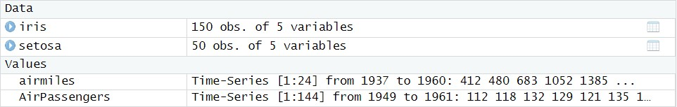

---
editor_options:
  markdown:
    wrap: 72
output:
  html_document:
    df_print: paged
---

# Coursework project

## on the module 1 "The Datascientist's Toolbox"

### **done by Alexandra Avdan**

#### *July 2023*

------------------------------------------------------------------------

> This project is available in the public repository on GitHub. You can
> check it following this
> [**link**](https://github.com/AlexashaSova/module1_coursework_avdan.git).

------------------------------------------------------------------------

The first step of this project is to load and analyze three datasets from the pre-installed R package **'datasets'**. The full list of packages, available at the named package, is available in the
[**link to the R documentation**](https://stat.ethz.ch/R-manual/R-devel/library/datasets/html/00Index.html). From the named library it was decided to pick 3 datasets by my own preferences to analyze data each of the selected datasets contains.

> Respecting to the fact, that our knowledge is not deep enough to build
> complex analysis, in my work is represented only brief look on each of
> datasets, within the basics of the descriptive analysis with the elements
> of exploratory approach in order to find some possible dependencies of
> the given data.

-   The first dataset is pretty classical dataset for this subject area,
    **'iris'**. This dataset represents measurements of *sepal length*,
    *sepal width*, *petal length* and *petal width* of the three iris species:
    *setosa*, *virginica* and *versicolor*. There are 50 rows per each
    of the iris species in the dataset.

```{r}
# get the data of the whole dataset
library(datasets)
data("iris")
```

On the image below are represented top 12 rows of the iris dataset,
ordered by index at the ascending order.


The next step is to obtain summary on the dataset.

The following summary contains values on the criteria, such as

-   *minimum (Min.)*,

-   *1st Quartile (1st Qu.)* (i.e. 25% of data was taken under the
    produced value),

-   *Median* (can be named as a middle value of some numeric sequence),

-   *Mean* (average value),

-   *3rd Quartile (3rd Qu.)* (i.e. 75% of data was taken under the
    produced value),

-   *maximum (Max.)*

    for **numeric values** and

-   *number of occurencies* of each value

    for **string values** (column *'Species'* in *iris* dataset).

Additionally, the range value can be calculated if needed. 
However, without any certain question, needed to be solved, these values are useless. According to the dataset data, this dataset has no missing values (no NaN or NULLs).

```{r}
summary(iris)
```

From the data below it is clear that all the metrics are calculated on
all the iris species. It would be more informative, if the metrics were
calculated on the certain needed iris type. 
Assume, we need to get some metrics on the iris *setosa*. Let's create dataframe with *setosa* values **only**.

```{r}
# attaching library dplyr to use filter() function
library(dplyr)
# to make it more usable to call the names of the columns making it to lowercase 
names(iris) <- tolower(names(iris))
# creating dataframe with setosa rows only
setosa <- filter(iris, species == "setosa")
# show top-6 values of the obtained dataframe ordered by the ascending of the index
head(setosa)
```

The next step is obtaining summary metrics on the measurements of
different *setosa* irises. According to the data of the column
*'species'* there are no other data here, except of *setosa* data. The
obtained metrics' data also differ from the previously obtained.

```{r}
summary(setosa)
```

The final step is creating visualizations. Note, that there was no
particular aim, set as a goal of investigations. 
The first visualization is done on the whole *iris* dataset. From the visualization below some conclusions could be made:

-   it was a bad practice to visualize the whole dataset, that contains
    both numeric and string values. The obtained row and column
    'species' is not pretty informative;
-   it is useful to assess the whole picture of the dataset, but for
    more accurate conclusions and results, more detailed visualizations
    have to be made.

```{r}
plot(iris)
```

Let's create a visualization of the created *setosa* data **only**
dataframe. The obtained visualization allows to make conclusions and
analysis on the certain type of iris flowers *setosa*. For this graph
comments and observation are the same, as for the previous one.

```{r}
plot(setosa)
```

To reveal the dependencies between the metrics of the dataset, we have
to build a more detailed visualization. To reveal the relationships
between *petal length* and *petal width* let's build a graph. 
**All the dataset *iris* will be analyzed**. 
From the obtained visualization it is clear, that in most cases increasing of petal length is connected with the increasing of petal width and vice versa. The other fact is that
there is no petal width and length values in the interval from 2 to 3
including these values. There is also one more interesting detail: there
is a cluster in the lower left corner. This cluster may contain data on
the miniature sized irises. That may be just small ones on any of the
represented types or just small type (that may be *setosa*, *versicolor*
or *virginica* with equal probabilities).

```{r}
plot(iris$petal.length, iris$petal.width)
```

More investigations can be made with the formulated question to solve.

------------------------------------------------------------------------

-   The second dataset is **'airmiles'**. This dataset is represented by
    the time series of values of flown passenger miles by the USA
    commercial airlines from 1937 to 1960.

It is important to highlight, that **iris** dataset is represented by
the *Data*, whereas **airmiles** and other dataset, that will be considered
later, **AirPassengers**, are represented by the *values of time-series*:



Let's visualize dataset **'airmiles'**. From the obtained visualization
can be made a conclusion, that with the time number of airmiles flown
increases. This characteristic increases particularly rapidly from 1947
to 1957. This decade was probably characterised by the technical
progress and popularization of air transport.

```{r}
library(datasets)
plot(airmiles)
```

-   The third dataset is **'AirPassengers'**. This dataset, as it was
    recently mentioned, is represented by the time-series of values of
    monthly totals of international airline passengers from 1949 to
    1960. 

Let's visualize dataset **'AirPassengers'**. From the obtained
visualization it is clear, that it's a representation of the non-linear
model. To make an exact conclusion about how does dependent
variable *(AirPassengers)* depends from the independent one *(Time)* it is
needed to approximate existing model to linear one by the means of
linear regression. Without this step it can be said that with the time
number of air passengers increases.

```{r}
library(datasets)
plot(AirPassengers)
```

During this work I've been doing commits on the [**linked GitHub repository.**](https://github.com/AlexashaSova/module1_coursework_avdan.git)
Here is commit history as an evidence of proper work:


